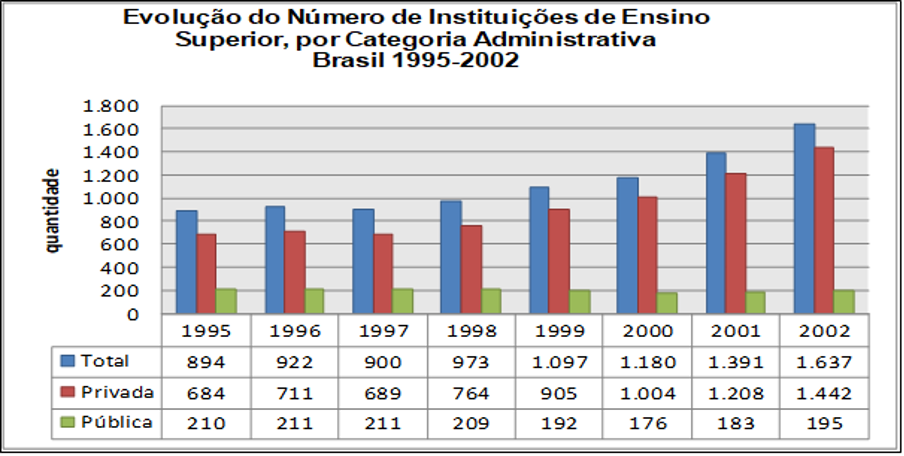

```{r setup, include=FALSE}
knitr::opts_chunk$set(echo = TRUE)
```


## 1. INTRODUÇÃO  

O presente estudo faz parte da disciplina de Ciência de Dados, ministrada pelo Prof. Dr. João Pedro Albino durante o segundo semestre de 2022 para o programa de Pós-graduação em Mídia Tecnologia da Unesp Bauru e tem como objetivo capacitar os alunos na leitura e Análise Exploratória de Dados (AED).
O objeto de estudo deste artigo trata sobre a pandemia de COVID-19, uma pandemia ainda em curso (01/2023) causada pelo coronavírus da síndrome respiratória aguda grave 2 (SARS-CoV-2). Identificado pela primeira vez na cidade de Wuhan, na China, em dezembro de 2019, logo se espalhou pelo mundo, fazendo com que a Organização Mundial da Saúde (OMS) classificasse o surto da doença como Pandemia em 11 de Março de 2020. Até 23 de janeiro de 2023, 668 860 867 casos foram confirmados em 228 países e territórios, com 6 739 424 mortes atribuídas à doença, tornando-se uma das mais mortais da história. (WIKIPEDIA, 2023). No Brasil, segundo o site https://covid.saude.gov.br/, até a presente data (23/01/2023) foram registrados 36.730.913 casos da doença, com 696.324 mortos, uma taxa de mortalidade na casa dos 1,9%. Como é possível inferir dos dados apresentados, milhões de vidas no Brasil foram afetadas, além de diversos setores da economia, como o varejo e em especial a educação.
 
Dentro desse contexto, este estudo pretende avaliar como as vidas de estudantes de Instituições de Ensino Superior foram afetadas graças às repentinas mudanças, como fechar os centros físicos, e transferir as aulas presenciais para um regime totalmente remoto e online, para impedir que o contágio da doença fosse ainda maior no período em questão. Dessa forma, foi realizada uma pesquisa do tipo survey exploratória-descritiva para a coleta de dados com uma amostra de estudantes de nível superior, de característica não probabilística e por conveniência, acessível via solicitação de participação por e-mail. Os indivíduos estudados nessa pesquisa foram selecionados porque estavam voluntariamente disponíveis e aceitaram participar da mesma através de um Termo de Consentimento Livre e Esclarecido, cujo questionário encontra-se disponível em <https://forms.gle/n25mY6GyuspZsQ9z9>.

Portanto, os objetivos desse artigo exploratório-descritivo são de contextualizar, com os dados recolhidos:
 - como as(os) estudantes universitárias(os) vivenciaram a pandemia da COVID-19;
 - de que forma se comportaram frente às restrições impostas pelos riscos de contágio; 
 - quais suas considerações a respeito das estratégias que foram adotadas pelas instituições de ensino superior; e 
 - como estes novos fatores as(os) influenciaram as atividades de formação acadêmica, profissionais e sua qualidade de vida (física e mental).  

## 2. REFERENCIAL TEÓRICO  
### 2.1 O Ensino Superior no Brasil: Breves considerações  
Na história da educação superior no Brasil o ensino superior privado tem dois momentos de destaque: o primeiro no período da Ditadura Militar na qual se verifica um grande crescimento nas suas matrículas (SAMPAIO, 2000) e a abertura de universidades públicas; o segundo com o governo (1º e 2º mandatos) de Fernando Henrique Cardoso no qual se verifica um aumento exponencial da rede privada de ensino.  
Sobre o primeiro momento acrescenta-se que a expansão do ensino superior foi decorrente da inclusão de setores médios da sociedade brasileira na educação superior motivada pelo aumento de instituições públicas, principalmente as federais e algumas estaduais e privadas (faculdades isoladas), em suas maiorias confessionais com perfil acadêmico e administrativo semelhante às universidades públicas. Para Sampaio (2000, p. 43) o período entre 1933 a 1965 caracterizava-se “pela consolidação e estabilidade no crescimento da participação relativa do setor privado no sistema de ensino superior” e de 1965 a 1980 correspondeu à “mudança de patamar no crescimento das matrículas”.  
A partir da década de 1950 predominavam no Brasil as instituições confessionais de ensino superior, que se caracterizavam pela qualidade de ensino, inclusive na indissociabilidade entre o ensino, a pesquisa e a extensão, mantidas pela comunidade, com forte ligação religiosa. Porém, a partir da década de 1960 elas disputaram espaços com as instituições privadas laicas, sendo que estas últimas acabaram sendo majoritárias a partir da década de 1970.  
A reforma universitária em 1968, com aprovação da Lei nº 5.540, representou uma mudança mais complexa na educação superior pela parceria estabelecida entre o MEC-USAID e a participação efetiva deste último no diagnóstico dos problemas relativos a este nível de ensino. Um dos pontos centrais e polêmicos da referida reforma estava na gestão estrutural, que incluía a racionalização de seus processos adequando-os aos moldes empresariais, mais flexíveis e modernos.  
A busca pela modernização do ensino superior, a partir de 1970, tinha como objetivo reduzir o abismo que separava as grandes potências da América Latina, mediante apropriação de padrões modernos, sendo que esta ideia agregou uma parcela de intelectuais e da elite na época. Em virtude de novas exigências da modernização, os países latino-americanos precisavam de força de trabalho capacitada para assumir novas funções, cabendo às instituições de ensino superior a responsabilidade da mudança ao oferecerem formação técnica.   
A partir da década de 1990, este cenário tende a se intensificar. Talvez o governo Fernando Henrique Cardoso tenha sido o maior expoente do aumento das instituições privadas, ao realizar a reforma do Estado “baseada em uma gestão moderna e orientada para práticas mais flexíveis, conforme orientação dos organismos internacionais” (FIUZA; PERES, 2009, p. 2), fortemente influenciada e apoiada pelo Banco Mundial, o Fundo Monetário Internacional (FMI) e o Banco Interamericano de Desenvolvimento (BIRD) dentre outros.  
Durante os mandatos de governo de Fernando Henrique Cardoso (1995-2002), em 1995, havia 894 instituições de ensino superior e em 2002, quando deixou o governo, eram 1.637 instituições, ou seja, aumento de 84% de novas instituições (cerca de 90 instituições novas por ano). O aumento foi ainda maior no que se refere às vagas ofertadas no período. Em 1995 existiam 610.355 vagas e em 2002 esse número saltou para 1.773.087, sendo que 1.477.733 vagas eram oferecidas pelo setor privado, conforme mostra o Gráfico 1 (MEC, 2003).



Fonte: Adaptado de censo da educação superior- resumo técnico 2003. MEC/INEP/DEEP.

Apesar da expansão das instituições de ensino superior ter propiciado maior abrangência de acesso ao ensino, ela não se deu de forma uniforme. A interiorização do ensino superior privado se concentrou principalmente nas instituições privadas e em regiões mais desenvolvidas como o sul e o Sudeste. Em 2008, por exemplo, 50% delas estavam localizadas na região sudeste e 17% na região sul.  
O Governo Fernando Henrique Cardoso representou uma nova fase de atuação das entidades representativas do ensino superior privado, principalmente com a Associação Brasileira de Mantenedoras de Ensino Superior (ABMES), que influenciou ativamente na definição da política educacional. No que tange a nova LBD, isso influenciou principalmente nos processos de autorização e reconhecimento de cursos, o modelo de avaliação e na elaboração do Plano Nacional de Educação (NEVES, 2002).  
Sobre a relevância da participação do setor privado no sistema de ensino superior brasileiro, o último Censo da Educação Superior em 2013 (INEP, 2013), apontou que existem no Brasil, conforme Tabela 1:  

Tabela 1 - Comparativo performance IES no Brasil  

| Categoria   | Total no Brasil  | IES Públicas |   IPES       |
|:------------|:----------------:|:------------:|:------------:|
| IES         |       2.391      |   16.600     |     2.090    |
| CURSOS      |       32.049     |  212.992     |    21.199    |
| MATRÍCULAS  |    7.305.977     |    1.371     | 5.373.450    |  
Fonte: INEP (2013).  

Os números apresentados demonstram a importância que as instituições privadas e o ensino superior privado vêm assumindo para a expansão do sistema educacional brasileiro.  
Não obstante, para Schwartzman e Schwartzman (2002, p.4):  
*Só recentemente, [...] o ensino superior privado vem recebendo dos analistas a atenção correspondente a sua importância. Uma explicação para isto é o fato de que, em diversos aspectos, o ensino privado discrepa do que normalmente se considera como o modelo ideal das instituições de ensino. Neste modelo ideal, o ensino superior se organizaria em universidades, enquanto que no ensino privado predominam as instituições isoladas e outras instituições não universitárias; as universidades deveriam ter um forte componente de pesquisa, que quase não existe no setor privado; as universidades dão ênfase às áreas técnicas e científicas e às profissões clássicas, enquanto que o setor privado se concentra nas profissões sociais; nas universidades, os professores participam das decisões acadêmicas em um complexo sistema de colegiados, enquanto que o poder nas instituições privadas é centralizado. Mais amplamente, a atividade cultural e intelectual costuma ser percebida como de natureza altruística, oposta à busca do lucro, enquanto o ensino privado, ainda que muitas vezes organizado em instituições não-lucrativas, têm quase sempre um claro componente comercial.*  

Aliado a estes comentários, vale considerar ainda que na adaptação das IPES a este universo diversificado e heterogêneo, elas precisam se adequar aos efeitos fiscais, às avaliações de qualidade, à evasão e inadimplência de alunos, o que representam fatores difíceis de serem resolvidos caso a estrutura organizacional da instituição não esteja amparada em uma gestão comprometida com as mudanças, com a realidade em que está inserida, na responsividade e nas tomadas de decisões mais assertivas.  
Além disso, convém ponderar o ambiente mercadológico fortemente marcado pela competitividade. A expansão do ensino superior trouxe consigo as marcas da diminuição dos diferenciais competitivos e a forte concorrência entre IES com diversificação de ofertas e serviços e cursos. Conjuntamente é isso, o ensino superior, de modo geral vem vivenciando principalmente desde 2005 uma desaceleração nas matrículas, o que reflete especialmente no ensino superior privado, que passa a buscar novas oportunidades de crescimento.
Adicionalmente, o perfil do alunado também vem sendo alterado. Mais conectado, o aluno do ensino superior, pode-se dizer, é mais exigente e possui novas necessidades e expectativas constituídas pela era digital.  
Todos esses fenômenos juntos configuram-se em um cenário de vulnerabilidades e forte concorrência, a gestão de uma IPES tornou-se uma tarefa desafiadora. Buscar por novas formas de se tornar mais competitiva e atrair a atenção do público-alvo, como também, desenvolver habilidades e criar ações inovadoras para o alunado tornou-se imprescindível para as IPES que pretendem êxito e superação dos problemas e desafios.  

## 3. COLETA DOS DADOS  
Como citado anteriormente, este trabalho foi realizado através da produção de uma pesquisa do tipo survey exploratória-descritiva, produzida pelo Prof. Dr. João Pedro Albino e disponibilizado aos alunos para a execução desta tarefa. A pesquisa foi veiculada pela internet entre os anos de 2021 e 2022 e teve um total de 52 respondentes.  
O perfil traçado para os respondentes era o de alunos do Ensino Superior, de todo o Brasil, de qualquer faixa etária que estivesse vinculado à uma Instituição no período citado acima e durante a pandemia da COVID-19, para que as perguntas sobre a sua Instituição fossem respondidas e se obtivessem dados conclusivos sobre a análise de tais alunos sobre a postura na adoção de medidas restritivas para conter a pandemia. Por isso, teve-se um cuidado na divulgação desta pesquisa para que os respondentes pudessem preencher os requisitos. 

## 4. PROCESSAMENTO E TRATAMENTO DE DADOS 
Antes de iniciar a dissertar sobre o processamento e tratamento de dados é importante conceituar o que é dados. De acordo com a Fia (2019, não paginado) “dados representam uma série de fatos, conceitos ou estatísticas que podem ser analisados para produzir informações”.  
Os dados originais coletados da pesquisa foram extraídos da ferramenta forms por meio de um arquivo externo ao ambiente de análise dos dados em uma planilha de cálculos. 
Como em todo processo de AED, houve a necessidade de normalização e padronização dos conteúdos para uso nas análises realizadas neste artigo.  
De acordo com Han, Kamber e Pei (2011) o processo de AED contempla a limpeza, preparação e tratamento dos dados, conhecido como a fase de pré-processamento. Esta fase é essencial para análise dos dados e conforme estudo, 80% da análise dos dados é consumida na limpeza e preparação dos dados (WICKHAM, 2014). O autor ainda ressalta que a preparação dos dados não é realizados apenas uma vez e sim em vários momentos e no percurso da análise dos dados, ao passo que novas problemáticas e lacunas surgem e novos dados são coletados ou acrescentados na pesquisa. Contato, apesar da importância da preparação dos dados e o tempo que consome faltam estudos na área sobre como limpar bem os dados e o processo sendo denominado também pelos autores como “higienização” (da SILVA, 2021).
Como os dados utilizados nesta análise vieram de questionários aplicados em diferentes etapas da pandemia (entre 2020 e 2023) alguns processos de limpeza e preparação foram empregados com o objetivo de normalizar as informações destes diferentes períodos.  
Para a realização das etapas de preparação, transformação, organização e estruturação foram utilizados recursos da **Linguagem R**, um software livre de programação voltada ao tratamento, análise e visualização de dados. A linguagem é largamente utilizada por acadêmicos, estatísticos e analistas de dados para realizar projetos de AED.  
A linguagem foi desenvolvida originalmente no departamento de Estatística da Universidade de Auckland, Nova Zelândia e sua manutenção é realizada por uma comunidade de colaboradores voluntários que contribuem para melhoria e otimização da linguagem e com a expansão das suas funcionalidades básicas por meio de bibliotecas, ou **packages** residentes no repositório *CRAN-R* (The Comprehensive R Archive Network) (LINGUAGEM R, 2022)[^1]. 
Com o objetivo de facilitar e agilizar o processo de desenvolvimento dos cálculos estatísticos e geração de gráficos na linguagem R, utilizou-se também o **Ambiente de Desenvolvimento Integrado** (do inglês Integrated Development Environment – IDE) *RStudio*, um programa de computador de fonte aberta com características e ferramentas de apoio ao desenvolvimento acelerado de software (LINGUAGEM R, 2022).  
Portanto, como tarefa inicial para a organização e estruturação dos dados, no Quadro 1 é possível visualizar o dicionário de dados com os nomes e as definições das variáveis utilizadas nesta AED. 

Quadro 1: Dicionário de dados.

| Nome da variável | Tipo de variável | Conteúdo                          | Descrição                                                   |
|:------------|:-----------:|:---------------------|:------------------------|
| data/ano                      |      data        | dd/mm/aaaa                        | Dia, mês e ano em que o questionário foi aplicado           |
| idade                         |      númerica    | Idade da(o) respondente           | Faixa etária dos respondentes 
| genero                        |      texto       | Feminino, Masculino, Outros ou NR | Gênero da(o) inquirida(o)                                         |
| situacao_conjugal             |      texto       | Solteiro, Casado, União Estável/Vivendo junto, Divorciado/Separado, Viúvo, NR  | Situação conjugal |
| situacao_empregaticia         |      texto       | Dependente, Bolsista, Estagiário, Empregado, Desempregado | Situação empregatícia e/ou financeira atual                                         |
| estado_reside                 |      texto       | SP, RJ, MG...                     | 27 estados da federação e DF                                        |
| ies                           |      texto       | Instituição de Ensino Superior    | Nome da IES da(o) estudante                                      |
| nome_curso                    |      texto       | Graduação ou pós-graduação.       | Nome do curso da(o) estudante                                          |
| nível_ensino                  |      texto       | Graduação ou pós-graduação.       | Nível do curso da(o) estudante                                          |
| data_inicio_ curso            |      data        | dd/mm/aaaa                        | Dia, mês e ano em que a(o) estudante inicou o curso na IES           |
| tipo_ies                      |      texto       | Privada, Pública, Outras          | Tipo da IES                                       |
| local_estudante               |      texto       | Local, Outra cidade, NR           | Local de origem do estudante                                       |
| migrou_virtual                |      texto       | Sim, Não, Não sei                 | Instituição migrou para as aulas virtuais                          |
| ies_fechou_dorm               |      texto       | Sim, Não, Não sei, Não se aplica  | Instituição fechou dormitórios                                     |
| situação_durante_pandemia     |      texto       | texto livre (até 250 palavras)    | Conjunto e diversidade da situação da pandemiana sua instituição                                   |
| data_fechamento               |      data        | dd/mm/aaaa                        | Dia, mês e ano em que a IES fechou           |
| residencia_atual              |      texto       | No campus universitário instituciona, Fora do campus, mas na mesma cidade da instituição de ensino, Em outra cidade da instituição de ensino mas dentro do mesmo estado, Em uma cidade em outro Estado, Em um pais diferente da instituição  | Onde o aluno está vivendo ou residindo atualmente           |
| moradia_atual_permanente      |      texto       | Sim, Não                          |  Moradia atual do aluno é uma residência permanente e estável|
| morando_com                   |      texto       | Colega de quarto/República, Família, Sozinho(a) |  Aluno morando ou residindo com/em |
| convive_risco_relevante       |      texto       | Sim, Não                          | Aluno morando ou convivendo atualmente com alguém na faixa etária  dos 60-70 anos, e/ou que tenha algum fator de risco relevante |
| quarentena_imposta            |      texto       | Sim, Não, Não sei                |  Aluno convive ou que está ou esteve em quarentena imposta pela COVID-19 |
| vivenciou                     |      texto       | Ajuda ou assistência de pessoas desconhecidas, Discriminação por pessoas desconhecidas, Dificuldades devido a alterações em suas condições de vida, incluindo o fechamento de alojamentos, perda de emprego etc., Dificuldades para viajar/se deslocar, Não se aplica / Não sabe / Não se lembra| Aluno vivenciou durante a pandemia |
| acesso_servicos_saude         |      texto       | N/A ou Não sabe, Muito pior do que antes, Pior do que antes, O mesmo de antes, Melhor do que antes, Muito melhor do que antes|  Como o aluno classifica o acesso aos serviços de saúde, comparado a antes e durante a pandemia |
| acesso_internet               |      texto       | N/A ou Não sabe, Muito pior do que antes, Pior do que antes, O mesmo de antes, Melhor do que antes, Muito melhor do que antes|  Como o aluno classifica o acesso aos serviços de internet, comparado a antes e durante a pandemia |
| capacidade_prosseguir_estudos |      texto       | N/A ou Não sabe, Muito pior do que antes, Pior do que antes, O mesmo de antes, Melhor do que antes, Muito melhor do que antes|  Como o aluno classifica sua capacidade em prosseguir seus estudos, incluindo sua graduação e/ou conclusão de curso |
| capacidade_socializacao       |      texto       | N/A ou Não sabe, Muito pior do que antes, Pior do que antes, O mesmo de antes, Melhor do que antes, Muito melhor do que antes|  Como o aluno classifica a sua capacidade de socialização |
| bem_estar_psicologico         |      texto       | N/A ou Não sabe, Muito pior do que antes, Pior do que antes, O mesmo de antes, Melhor do que antes, Muito melhor do que antes|  Como o aluno classifica seu bem-estar psicológico em geral, incluindo sentimentos de ansiedade e/ou depressão |
| qualidade_de_vida             |      texto       | texto livre (até 250 palavras) | Variedade e diversidade de experiências com relação qualidade de vida do aluno |
| aulas_durante_pandemia        |      texto       | Pioraram, Foram mais ou menos o mesmo, Melhoraram, N/A ou Não sabe | Opinião sobre a forma como as aulas foram ministradas durante a pandemia |
| acesso_professores            |      texto       | Piorou, Foi mais ou menos o mesmo, Melhorou, N/A ou Não sabe | Opinião sobre formas de acesso aos seus professores durante a pandemia |
| acesso_infra_ies              |      texto       | Pioraram, Foram mais ou menos o mesmo, Melhorou, N/A ou Não sabe | Opinião sobre formas de acesso aos recursos de infraestrutura oferecidos pela IES |
| espaco_físico                 |      texto       | Piorou, Era mais ou menos o mesmo, Melhorou, N/A ou Não sabe | Opinião sobre formas de acesso aos recursos de infraestrutura oferecidos pela IES |
| disposicao_atividades         |      texto       | Diminuiu, Ficou mais ou menos a mesma, Aumentou, N/A ou Não sabe | Opinião sobre disposição para participar das aulas/atividades, estudar e aprender|
| desempenho_escolar            |      texto       | Diminuiu, Ficou mais ou menos a mesma, Aumentou, N/A ou Não sabe | Opinião sobre desempenho escolar durante a pandemia|
| ies_reinicio                  |      texto       | Sim (retornou todas as atividades presenciais), Não, ainda não retornou nenhuma atividade presencial, Em parte (apenas algumas atividades presenciais retornaram), N/A ou Não sabe | A IES reiniciou atividades presenciais no campus e/ou faculdade|
| data_reinicio                 |      data         | dd/mm/aaaa                         | Dia, mês e ano em que a IES retornou atividades|
| vacinado                      |      texto        | Sim, com uma dose, Sim vacinado com duas doses ou com vacina de dose única, Sim, vacinado com duas doses ou com vacina de dose única e dose(s) de reforço, Não fui vacinado ainda com nenhuma dose, N/A ou Não quero responder | Aluno vacinado contra a COVID-19 |
| dificuldades_academicas       |      texto       | texto livre (até 250 palavras) | Variedade e diversidade de experiências com relação às dificuldades acadêmicas do aluno na pandemia |
| despesas                      |      texto       | Diminuiram, Ficou mais ou menos os mesmos, Aumentaram, N/A ou Não quero responder | Gastos/despesas do aluno durante a pandemia|
| renda_Financeira              |      texto       | Diminuiu, Está mais ou menos a mesma, Aumentou, N/A ou Não sabe  | Alteração na renda financeira do aluno durante a pandemia|
| ajuda_Financeira              |      texto       | Sim, Não, NA / Não sei                                           | Recebeu ajuda financeira da IES ou outra organização durante a pandemia|
| nivel_endividamento           |      texto       | Diminuiram, Estão mais ou menos as mesmas, Aumentaram, N/A ou Não sabe  | Dívidas (nível de endividamento) do aluno durante a pandemia|
| despesas_cresceram            |      texto       | Relacionadas com saúde, Viagens/deslocamentos, Transporte urbano, Aluguel, Internet, Alimentação, Outras (não relacionadas) | Dívidas (nível de endividamento) do aluno durante a pandemia|
| dificuldades_financeiras       |      texto       | texto livre (até 250 palavras) | Variedade e diversidade de experiências com relação às dificuldades financeiras do aluno na pandemia |
| decisao_fechar                 |      texto       | Muito rapidamente, De forma oportuna e prudente, Muito lentamente, N/A ou Não sabe | Opinião sobre decisão da IES em fechar o campus e utilizar ferramentas online para as aulas|
| ies_positivo                   |      texto       | texto livre (até 250 palavras) | Opinião sobre o que a IES fez de positivo em resposta à pandemia|
| ies_melhorar                   |      texto       | texto livre (até 250 palavras) | Opinião sobre o que a IES poderia ter melhorado em resposta à pandemia|
| ies_ajudar                     |      texto       | texto livre (até 250 palavras) | Opinião sobre comoa IES poderia ter ajudado mais em resposta à pandemia|
| nivel_ansiedade                |      texto       | N/A ou Não sabe, Muito pior do que antes, Pior do que antes, O mesmo de antes, Melhor do que antes, Muito melhor do que antes | Nível de ansiedade do aluno na pandemia|
| ansiedade_planejamento         |      texto       | N/A ou Não sabe, Muito pior do que antes, Pior do que antes, O mesmo de antes, Melhor do que antes, Muito melhor do que antes | Ansiedade do aluno para planejamento pessoal |
| ansiedade_longo_prazo          |      texto       | N/A ou Não sabe, Muito pior do que antes, Pior do que antes, O mesmo de antes, Melhor do que antes, Muito melhor do que antes | Ansiedade do aluno para planejamento de longo prazo |
| detalhes_finais                |      texto       | texto livre (até 250 palavras) | Relatar de forma detalhada e livre como vivenciou a COVID-19|

Fonte: Elaborado por João Pedro Albino (2023).  

[^1]: : <https://cran.r-project.org/>.

```{r configurações_iniciais, include=FALSE}
knitr::opts_chunk$set(echo = TRUE)
# - ETAPA INICIAL
#--- Importação e preparação dos dados

# Lendo o arquivo em .csv
dbf.csv <-read.csv("../dados/COVID19IES.csv", header = TRUE, sep = ";", quote = "\"", dec = ".")
```

No Tópico 5 serão mostrados o conjunto de gráficos utilizados na pesquisa em tela.  

## 5. GERAÇÃO DE GRÁFICOS PARA VISUALIZAÇÃO E GERAÇÃO DE CONCLUSÕES  
Todos os dados apresentados, coletados e tratados pela pesquisa foram inseridos na forma de código no programa RStudio. 
Um projeto foi gerado dentro do programa a fim de processar os dados já tratados e transformá-los em gráficos visualizáveis para que as conclusões pudessem ser retiradas do estudo.  
O DataViz (ou data visualization) é a representação gráfica de um conjunto de dados (como barras, mapas ou esquemas), para que eles possam ser interpretados mais rapidamente, a partir da identificação de conceitos e padrões para a tomada de decisão. Além disso, essa ferramenta ajuda a representar narrativas com dados, para um entendimento profundo dos negócios e resultados[^2]. 
Dessa forma, nos utilizando da visualização de dados, pudemos tirar as conclusões a respeito da amostra que tivemos disponível através da coleta dos dados. É importante ressaltar que as conclusões realizadas por este grupo não representam um retrato fidedigno da realidade das Instituições Superiores de Ensino brasileiras e de seus alunos por conta da pequena parcela amostral coletada pela pesquisa, e de que se trata apenas de um estudo para a disciplina de Ciência de Dados ministrada pelo Prof. Dr. João Pedro Albino durante o segundo semestre do ano de 2022 no Programa de Pós-Graduação em Mídia e Tecnologia da Unesp de Bauru.

[^2]: Data visualization: o que é DataViz e qual sua importância para Produto. PM3 Blog. 22 set. 2022. Disponível em: <https://www.cursospm3.com.br/blog/data-visualization-o-que-e-dataviz-e-importancia-para-produto/>. Acessado em: 26/01/2023.  

```{r grafico_faixa_etaria, echo=FALSE, fig.align = 'center', fig.width=15, fig.height=9}
## Gráfico 1 Faixa Etária dos respondentes
# Versão 2, utilizando a definição divisão das faixas etárias:
# 17 - 21
# 22 - 26
# 27 - 31
# 32 - 36
# 37 - 41
# 42 - 46 
# 47 - 51 
# 52 - 56
# 57 - 61

idade_concat <- data.frame(idade=dbf.csv$idade, faixa_etaria="")

for (k in 1:nrow(idade_concat)) {
  if(idade_concat$idade[k] <= 21) idade_concat$faixa_etaria[k] <- "17 a 21 anos"
  if(idade_concat$idade[k] >= 22 & idade_concat$idade[k] <= 26) idade_concat$faixa_etaria[k] <- "22 a 26 anos"
  if(idade_concat$idade[k] >= 27 & idade_concat$idade[k] <= 31) idade_concat$faixa_etaria[k] <- "27 a 31 anos"
  if(idade_concat$idade[k] >= 32 & idade_concat$idade[k] <= 36) idade_concat$faixa_etaria[k] <- "32 a 36 anos"
  if(idade_concat$idade[k] >= 37 & idade_concat$idade[k] <= 41) idade_concat$faixa_etaria[k] <- "37 a 41 anos"
  if(idade_concat$idade[k] >= 42 & idade_concat$idade[k] <= 46) idade_concat$faixa_etaria[k] <- "42 a 46 anos" 
  if(idade_concat$idade[k] >= 47 & idade_concat$idade[k] <= 51) idade_concat$faixa_etaria[k] <- "47 a 51 anos" 
  if(idade_concat$idade[k] >= 52 & idade_concat$idade[k] <= 56) idade_concat$faixa_etaria[k] <- "52 a 56 anos"
  if(idade_concat$idade[k] >= 57 & idade_concat$idade[k] <= 61) idade_concat$faixa_etaria[k] <- "57 a 61 anos"
  if(idade_concat$idade[k] > 61) idade_concat$faixa_etaria[k] <- "acima de 61 anos"
}

casos_idade_concat <- table(idade_concat$faixa_etaria)

#Cálculo da porcentagem das faixas etárias
pct_idade3 <- paste0(round(unname(casos_idade_concat) / sum(unname(casos_idade_concat)) * 100,0), "%")

# Gráfico do tipo barra das faixas etárias
graph.idade_concat <- barplot(casos_idade_concat, 
                               main = "Gráfico 1: Faixa etária dos respondentes",
                               xlab = "Faixa Etária", 
                               ylab = "Respondentes",
                               col = "orange",
                               horiz = F,
                               ylim = c(0,max(casos_idade_concat) + 5))
text(x = graph.idade_concat, y = casos_idade_concat, label = unname(casos_idade_concat), cex=1, pos=3)
axis(1, at=graph.idade_concat, labels=paste("(", pct_idade3, ")"), tick=F, las=1, line=-1.0, cex.axis= 1.1)

# Dados para o Gráfico 2
casos_genero <- table(dbf.csv$genero)
pct_genero <- paste(round(unname(casos_genero) / sum(unname(casos_genero)) * 100), "%")

```

```{r grafico2_genero, echo=FALSE, fig.align = 'center', fig.width=10, fig.height=6}

#Gráfico 2: Quantidade de respondentes por sexo
# Gráfico tipo "pizza"
pie(casos_genero,
    edges = 200, radius = 0.8,
    clockwise = F,
    density = NULL, angle = 90, col = c("red", "orange", "yellow", "green"),
    labels = paste(names(casos_genero), "-", pct_genero),
    main = "Gráfico 2: Quantidade de respondentes por gênero")

```

```{r grafico3_situacao_empregaticia, echo=FALSE, fig.align = 'center', fig.width=10, fig.height=6}
# Dados do Gráfico 3
casos_emprego <- table(dbf.csv$situacao_empregaticia)
# casos_emprego

# Rótulos muito grandes  em grande quantidade. Dificuldade para exibir nos gráficos
# Redução proposital dos textos
names(casos_emprego) <- c("Aposentada", "Bolsista","Corretor", "Dep./Empr.", "Dependente",
                          "Desemp.","Empregado","Empresária","Estagiário","Micro-emp.",
                          "Serv. púb.", "Autôn/Dep.")
#casos_emprego

pct_emprego <- paste(round(unname(casos_emprego) / sum(unname(casos_emprego)) * 100), "%")
#pct_emprego

#Gráfico 3: Quantidade de respondentes por situação empregatícia
# Gráfico tipo "pizza"
pie(casos_emprego,
    edges = 200, radius = 0.8,
    clockwise = F,
    density = NULL, angle = 90, col = c("red", "orange", "yellow", "green", "black"),
    labels = paste(names(casos_emprego), "-", pct_emprego),
    main = "Gráfico 3: Quantidade de respondentes por situação empregatícia")


```

```{r grafico4_respondentes_por_estado, echo=FALSE, fig.align = 'center', fig.width=10, fig.height=6}
# Dados do Gráfico 4
casos_estado <- table(dbf.csv$estado_reside, exclude = NULL)
#casos_estado
#  AM   SP <NA> 
#   1   47    4

pct_estado <- paste(round(unname(casos_estado) / sum(unname(casos_estado)) * 100), "%")
#pct_estado  
#[1] "2 %"  "90 %" "8 %"

names(pct_estado) <-c("Não Respondeu", "Amazonas", "São Paulo")

#Gráfico 4: Quantidade de respondentes por estado
# Gráfico tipo "pizza"
pie(casos_estado,
    edges = 200, radius = 0.8,
    clockwise = F,
    density = NULL, angle = 90, col = c("red", "orange", "yellow", "green", "black"),
    labels = paste(names(pct_estado), "-", pct_estado),
    main = "Gráfico 4: Quantidade de respondentes por estado")
```

```{r grafico5_nivel_instrucao, echo=FALSE, fig.align = 'center', fig.width=10, fig.height=6}

# Dados do Gráfico 5
casos_ensino<- table(dbf.csv$nivel_ensino, exclude = NULL)
# Doutorado     Ensino Técnico Especialização/MBA          Graduação           Mestrado      Pós-doutorado 
#        15                  1                  1                 21                 13                  1 

pct_ensino <- paste(round(unname(casos_ensino) / sum(unname(casos_ensino)) * 100), "%")
#[1] "29 %" "2 %"  "2 %"  "40 %" "25 %" "2 %" 

#Gráfico 5: Quantidade de respondentes nível de ensino
# Gráfico tipo "pizza"
pie(casos_ensino,
    edges = 200, radius = 0.8,
    clockwise = T,
    density = NULL, angle = 90, col = c("red", "orange", "yellow", "green", "black", "white"),
    labels = paste(names(casos_ensino), "-", pct_ensino),
    main = "Gráfico 5: Quantidade de respondentes por nível de ensino")
```

#### Outros 36 gráficos ?

## 6. CONCLUSÃO  
A pesquisa trouxe informações diversas sobre o cenário da pandemia da Covid-19, e em como os alunos vivenciaram. A investigação deste estudo trouxe os dados coletados em pesquisa do tipo “survey” e identificou que 48% dos alunos, que responderam o questionário, estão numa faixa etária entre 17 e 26 anos, e, que 46% estão empregados, 19% são bolsistas, 13% dependentes e 4% desempregados. A maioria deles, um percentual de 69%, mora com a família, porém apenas 25% desses, moram com pessoas de grupos considerados de risco para a doença da COVID-19.  
A partir destas análises de dados, podemos concluir que a preocupação com os familiares e que poderiam estar no grupo de risco é formado por uma parcela pequena dos respondentes, o que faz com que as preocupações no ambiente familiar sejam reduzidas no risco de contágio. A investigação trouxe também que um alto número dos entrevistados possui algum tipo de renda, caracterizando uma diminuição das preocupações com relação às necessidades básicas de sobrevivência.  
O estudo demonstrou, através do gráfico 18, quais foram as dificuldades vividas pelos alunos respondentes da pesquisa. Como conclusão, o percentual de 37% teve dificuldades em se deslocar ou viajar. Ao analisar os dados cruzados e, como 69% dos entrevistados moram com suas famílias, podemos inferir que a dificuldade no deslocamento é referente ao trabalho e à Instituição de Ensino do aluno. Outra dificuldade observada pela pesquisa foram as alterações nas condições de vida, com 17% das respostas. Nesse sentido, as alterações podem se relacionar com a perda de emprego, fechamento de alojamentos das instituições etc. 
A pesquisa respondeu que 8% dos participantes informaram ter recebido ajuda ou assistência de pessoas desconhecidas, demonstrando certa vulnerabilidade social em uma parcela dos alunos.  
Ao analisar outras informações, a pesquisa revelou que 50% dos alunos, conforme o gráfico 23, têm seu bem-estar psicológico pior do que antes da pandemia. Esses dados nos dizem algo sobre a capacidade dos estudantes em concluir ou prosseguir com seus estudos e de socialização. Demonstrou, ainda, que 33% alegaram que a situação dos estudos durante a Pandemia foi pior do que antes e 38% responderam que a sua capacidade para socialização também estava pior do que antes da pandemia.  
Ao aliar aos dados citados no parágrafo anterior, os dados do gráfico 44, que diz sobre o nível de ansiedade quanto ao futuro, revelou que 35% têm uma ansiedade pior do que antes e outros 19%, muito pior do que antes. Para a questão do planejamento pessoal, a ansiedade segue a mesma tendência, com 42% pior do que antes e 15% muito pior do que antes, como apontou as análises do gráfico 45.  
Em relação ao comportamento frente às restrições impostas pelo risco de contágio, o gráfico 32 ilustra que 77% dos alunos respondentes se comprometeram em seguir os protocolos sanitários e se vacinaram com duas ou mais doses da vacina contra a COVID-19. Com essas informações, podemos concluir que os alunos respeitaram as restrições impostas para retornarem às atividades presenciais das Instituições de ensino. 
O questionário abordou entre os participantes quais foram as considerações a respeito das estratégias e que foram adotadas pelas instituições superiores. Neste tópico, o resultado da pesquisa apontou que 98% dos respondentes migraram suas atividades de Ensino Superior totalmente para o Ensino Virtual. Com isso, pode-se perceber que boa parte dos alunos não gostaram da forma como as aulas foram ministradas virtualmente durante o período de restrições sanitárias, visto que 42% deles alegaram que a forma como as aulas foram ministradas durante a pandemia piorou conforme ilustra o gráfico 25. Por outro lado, 48% disseram não perceber diferenças na qualidade das aulas.  
Essa percepção dicotômica também pode ser percebida no gráfico 26, quanto à indagação ao acesso aos professores durante o período, onde 52% dos inquiridos sinalizaram que o acesso aos docentes piorou, enquanto 40% dizem ter melhora ou mantidos como anteriormente.  
Outro questionamento feito foi sobre a disposição para participar das atividades escolares durante a pandemia, e neste ínterim, diante do gráfico 29 é possível visualizar um equilíbrio nas respostas, pois 50% sinalizaram ter diminuído sua disposição, enquanto 27% dizem ter a mesma energia e 21% dizem ter aumentado a vontade em participar das aulas. Porém, quando questionados sobre o desempenho escolar durante o período (gráfico 30), apenas 31% deles diz ter diminuído suas notas. Podemos perceber que, mesmo as mudanças na forma como os alunos poderiam participar das aulas, e terem se dividido entre ter vontade ou não em participar das mesmas, poucos relataram que seu desempenho tenha sido afetado pelo ensino ter sido de maneira remota. 
Apesar de estarem divididos sobre a qualidade das aulas durante o período da pandemia, e vale destacar nesta pesquisa é que 77% dos alunos respondentes (gráfico 40) julgaram que suas instituições de ensino fizeram de forma prudente e oportuna o fechamento de suas unidades físicas e o início da utilização de ferramentas online para que as aulas pudessem continuar.  
A investigação buscou levantar-se em como estes fatores influenciaram a vida dos entrevistados que responderam ao questionário. O resultado foi que 33% dos alunos disseram ter aumentado seus gastos durante a pandemia. Isso pode ser justificado pelo nível de ansiedade relatado pelos alunos anteriormente. Por conta das restrições sanitárias e o distanciamento social, a ansiedade de algumas pessoas por estarem muito tempo em casa pode aumentar, fazendo com que elas busquem alguns escapes, como é o caso das compras online.  São pequenos prazeres de consumo, que fazem com que os gastos aumentem conjuntamente. Isso se agrava, quando percebemos no gráfico 35 que 48% dos alunos tiveram sua renda diminuída e 85% deles não receberam nenhum tipo de auxílio da sua Instituição de Ensino.  
As despesas que mais aumentaram, segundo os alunos, foram relacionadas à alimentação (25%) e transporte urbano (15%). O nível de ansiedade do planejamento pessoal citado anteriormente também envolve renda e despesas, o que faz sentido percebemos muitas respostas relatando o aumento no nível da ansiedade em relação a esse ponto.  

## REFERÊNCIAS

FIUZA, A. L; PERES, C. O método comparativo na análise do processo de privatização do ensino superior brasileiro. IN: Tercer Congreso Nacional y Segundo Encuentro Internacional de Estudios Comparados en Educación, 1, 2009, Buenos Aires, 2009. 

INSTITUTO NACIONAL DE ESTUDOS E PESQUISA. Censo da educação 2013. São Paulo, 2013. Disponível em . Acesso em 10 jun 2022. 

NEVES, L.M.W; FERNANDES, R. R. O empresariamento da educação: novos contornos do ensino superior no Brasil dos anos 1990. São Paulo: Xamã, 2002.

Pandemia de Covid-19. Disponível em: <https://pt.wikipedia.org/wiki/Pandemia_de_COVID-19>. Acesso em 23/01/2023

Painel Coronavírus. Disponível em:<https://covid.saude.gov.br/>. Acesso em 23/01/2023

Data Visualization: o que é DataViz e qual a sua importância para produto. Disponível em: <https://www.cursospm3.com.br/blog/data-visualization-o-que-e-dataviz-e-importancia-para-produto/>. Acesso em 26/01/2023

SAMPAIO, H. O ensino superior no Brasil: o setor privado. São Paulo: Fapesp/Hucitec, 2000.  

SCHWARTZMAN, J; SCHWARTZAMN, S. O ensino superior privado como setor econômico. 2002. Disponível em: < http://www.schwartzman.org.br/simon/pdf/suppriv.pdf>. Acesso em 10 nov. 2022.
 
WICKHAM, Hadley, GROLEMUND, Garret. R for Data Science: Import, Tidy, Transform, Visualize and Model Data. Sebastopol: O'Relly Media, 2017.  

WICKHAM, H. Tidy Data. Journal of Statistical Software, [S. l.], v. 59, n. 10, p. 1–23, 2014. DOI: 10.18637/jss.v059.i10. Disponível em: https://www.jstatsoft.org/index.php/jss/article/view/v059i10. Acesso em: 26 jul. 2022. 


